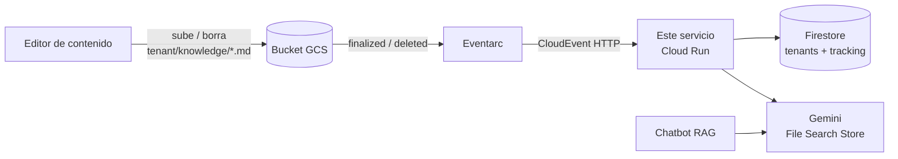

# RAG Ingest (Eventarc)

[](https://github.com/santiagovalenzuelalopez-gif/rag-ingest-eventarc/actions/workflows/ci.yml)


Servicio **event-driven** que mantiene sincronizada la base de conocimiento de cada tenant: cuando alguien sube, reemplaza o borra un archivo en un bucket de GCS, **Eventarc** invoca este servicio en Cloud Run y actualiza el **File Search Store de Gemini** de ese tenant.

Es la pareja de ingesta de [multitenant-rag-chatbot](https://github.com/santiagovalenzuelalopez-gif/multitenant-rag-chatbot): el chatbot responde, este servicio mantiene su conocimiento al día. Corre completo **sin credenciales** gracias a adaptadores en memoria.



## El problema difícil: eventos at-least-once

GCS/Eventarc entrega eventos **al menos una vez**: pueden llegar duplicados, fuera de orden y se reintentan ante un 5xx. Todo el diseño gira en torno a eso:

| Situación real | Cómo se resuelve |
|---|---|
| Evento duplicado o más viejo que el ya procesado | Se compara la **generación** del objeto con la registrada: `<=` → se omite |
| Sobrescribir un archivo emite `finalized` (nuevo) **y** `deleted` (viejo); el `deleted` llega tarde | Si hay una generación más nueva registrada, el `deleted` no borra la versión nueva |
| Reemplazar un archivo | Se borra la versión previa y se importa la nueva: sin duplicados en el RAG |
| El import falla o se atasca (long-running operation) | Se limpia el documento huérfano, no se registra nada y se devuelve **500** para que Eventarc reintente |
| Archivo subido a una carpeta de un tenant inexistente | Se descarta con **204** (no auto-provisiona clientes fantasma ni gasta reintentos) |
| Cambio de `identity.json` / `protocol.json` | No hay nada que ingestar; el chatbot lo recoge al vencer su caché |

La lógica vive en [`ingestion.py`](app/services/ingestion.py) y depende solo de **puertos** ([`ports.py`](app/services/ports.py)); por eso se prueba con 27 tests sin red, incluyendo el orden de eventos y los reintentos.

## Ejecutar (modo demo)

```bash
pip install -r requirements-dev.txt
uvicorn app.main:app --reload

# en otra terminal: simular lo que haría Eventarc
python scripts/send_event.py finalized demo/knowledge/faq.md --generation 1
python scripts/send_event.py finalized demo/knowledge/faq.md --generation 2   # reemplaza, sin duplicar
python scripts/send_event.py finalized demo/knowledge/faq.md --generation 1   # viejo: se omite
curl localhost:8000/demo/state                                               # documentos y tracking
python scripts/send_event.py deleted demo/knowledge/faq.md --generation 1     # deleted tardío: no borra la v2
```

o `docker compose up --build` (el servicio queda en el puerto 8080).

## Contrato HTTP

| Método | Ruta | Descripción |
|---|---|---|
| `POST` | `/events/gcs` | CloudEvent de GCS. **204** procesado o descartado a propósito · **500** fallo transitorio, que reintente |
| `GET` | `/health`, `/version` | Sondas |
| `GET` | `/demo/state` | Solo con `BACKEND=memory`: estado interno para la demo |

Convención de objetos en el bucket: `<tenant_id>/knowledge/<ruta>` (se ingesta) y `<tenant_id>/*.json` (configuración, se ignora).

## Modo producción (GCP)

```bash
pip install -r requirements-gcp.txt
export BACKEND=gcp GCP_PROJECT=<proyecto> GEMINI_API_KEY=<desde Secret Manager> ALLOWED_BUCKET=<bucket>
docker build --build-arg REQUIREMENTS=requirements-gcp.txt -t rag-ingest .
```

Trigger de Eventarc (uno por tipo de evento) hacia el servicio de Cloud Run, que **no** debe ser público:

```bash
for TYPE in finalized deleted; do
  gcloud eventarc triggers create ingest-$TYPE \
    --location=<region> \
    --event-filters="type=google.cloud.storage.object.v1.$TYPE" \
    --event-filters="bucket=<bucket>" \
    --destination-run-service=<servicio> --destination-run-path=/events/gcs \
    --service-account=<sa-eventarc>
done
```

Servicio desplegado con `--no-allow-unauthenticated`, y la cuenta de Eventarc con `roles/run.invoker`. Detalle de permisos mínimos en [docs/ARQUITECTURA.md](docs/ARQUITECTURA.md).

## Variables de entorno

Ver [`.env.example`](.env.example).

| Variable | Default | Descripción |
|---|---|---|
| `BACKEND` | `memory` | `memory` (demo/tests) o `gcp` (Firestore + Gemini) |
| `DEMO_TENANTS` | `demo` | Tenants activos del backend en memoria |
| `ALLOWED_BUCKET` | – | Si se define, se ignoran eventos de otros buckets |
| `GEMINI_API_KEY` | – | Solo `BACKEND=gcp`; usar gestor de secretos |
| `IMPORT_POLL_ATTEMPTS` / `IMPORT_POLL_INTERVAL_SECONDS` | `30` / `2` | Espera de la operación de import |

## Tests

```bash
pytest -q       # 27 tests, sin red ni credenciales
ruff check .
```

## Estructura

```
app/
  core/        config, logging JSON, middleware de correlación
  routers/     events (webhook), health, demo
  services/
    ports.py      contratos: TenantRegistry, TrackingStore, KnowledgeStore
    ingestion.py  lógica de sincronización (sin infraestructura)
    adapters/     memory | firestore | gemini
scripts/send_event.py   simula un CloudEvent
```

## Licencia

MIT
