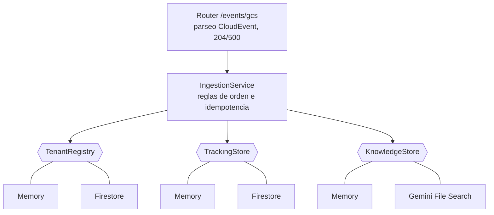
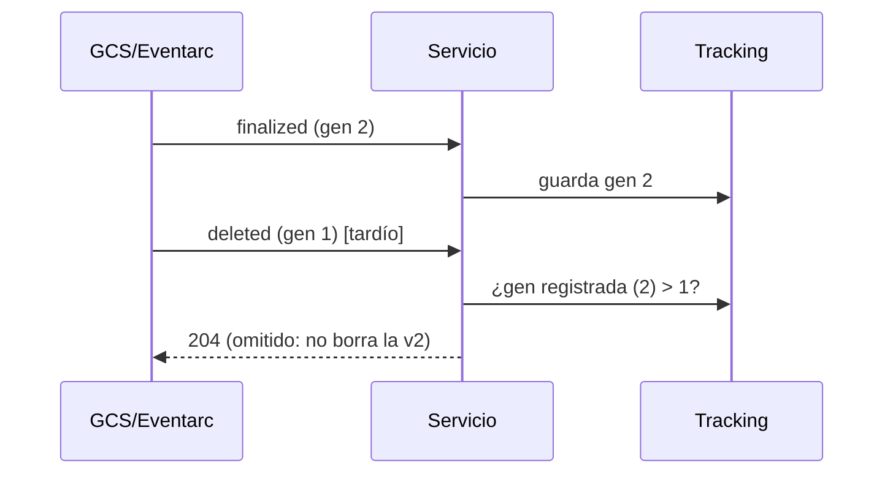

# Arquitectura

## Puertos y adaptadores

El servicio de dominio no importa ningún SDK de Google. Los adaptadores de GCP usan imports perezosos, de modo que el modo demo ni siquiera necesita las dependencias instaladas.

## ADR-1: generación como reloj lógico

**Contexto.** Eventarc no garantiza orden. Un archivo sobrescrito produce `finalized(v2)` y `deleted(v1)`, y pueden llegar en cualquier orden.

**Decisión.** Cada documento importado se registra con la `generation` del objeto de GCS (monótona por objeto). Un `finalized` con generación `<=` a la registrada se descarta; un `deleted` con generación `<` a la registrada también.

**Consecuencias.** Reentregas, duplicados y desórdenes son inofensivos. Un evento sin generación (p. ej. emisores no-GCS) se procesa siempre, a costa de no poder detectar su antigüedad.

## ADR-2: contrato de respuesta HTTP = política de reintentos

- **204** cuando el evento se procesó **o** no tiene sentido reintentarlo (tenant desconocido, ruta inválida, bucket ajeno, campos faltantes).
- **500** solo ante fallos transitorios (Gemini caído, timeout de import).

Devolver 5xx por un evento irrecuperable llenaría la cola de reintentos de basura; devolver 2xx por uno recuperable perdería el dato.

## ADR-3: reemplazo = borrar y luego importar

El import de Gemini File Search no actualiza en sitio. Se borra la versión previa (mejor esfuerzo: un fallo aquí solo se registra) y se importa la nueva. Si el import falla, **no se registra tracking**, así el reintento parte de un estado consistente: sin documento previo ni duplicados.

Un import fallido o atascado puede dejar un documento a medias (PENDING/FAILED) dentro del store sin tracking; el adaptador de Gemini lo descarta antes de propagar el error, porque el siguiente reintento importaría otra copia y quedaría duplicado en el RAG.

## ADR-4: long-running operation fuera del event loop

`import_file` es asíncrona en Gemini y se espera con polling (hasta `IMPORT_POLL_ATTEMPTS × IMPORT_POLL_INTERVAL_SECONDS`). El SDK es síncrono: el handler ejecuta la lógica con `asyncio.to_thread` para no bloquear el servidor mientras espera.

## ADR-5: ids de Firestore inyectivos

Los ids de documento no admiten `/`. Reemplazar `/` por `__` colisiona con rutas que ya contengan `__`; se usa `urllib.parse.quote(path, safe="")`, que es inyectivo.

## Seguridad

- Servicio de Cloud Run **no público** (`--no-allow-unauthenticated`); solo la cuenta de Eventarc con `roles/run.invoker`.
- `tenant_id` validado con regex y rutas con `..` rechazadas (un objeto con nombre malicioso no puede salir de su carpeta de tenant).
- `ALLOWED_BUCKET` descarta eventos de buckets inesperados.
- Un tenant se da de alta de forma explícita; un archivo en una carpeta desconocida no provisiona nada.
- Permisos mínimos sugeridos para la cuenta del servicio: lectura de objetos del bucket (`roles/storage.objectViewer`) y `roles/datastore.user` sobre Firestore. La clave de Gemini viene de un gestor de secretos.
- El scope `devstorage.read_only` debe pedirse explícitamente en las credenciales para `register_files`; el scope por defecto no alcanza.
